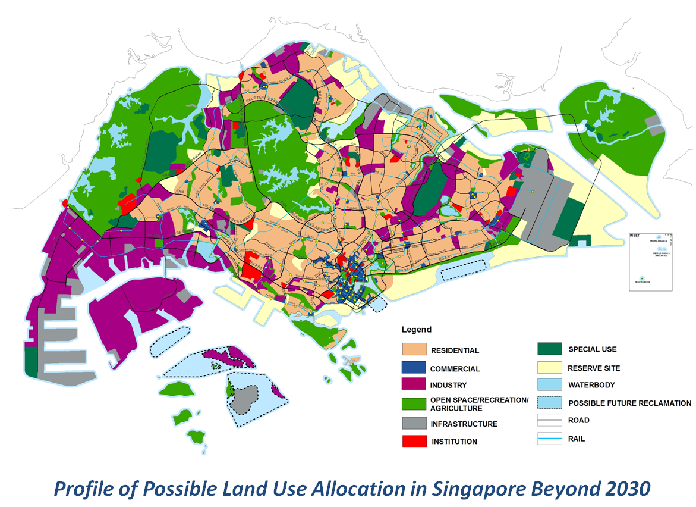
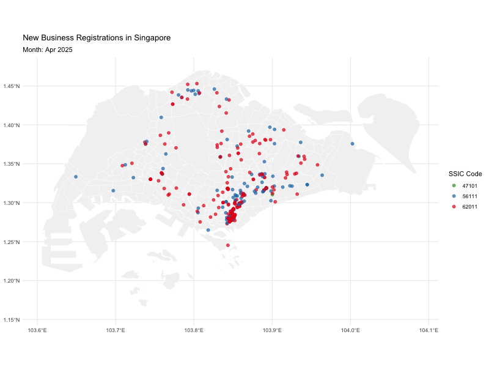
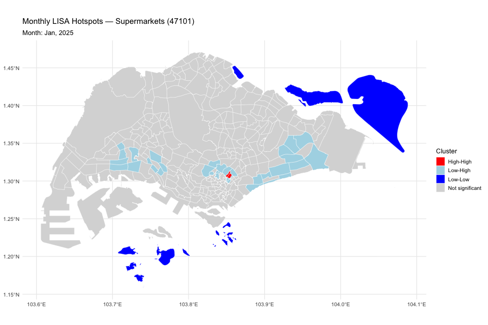
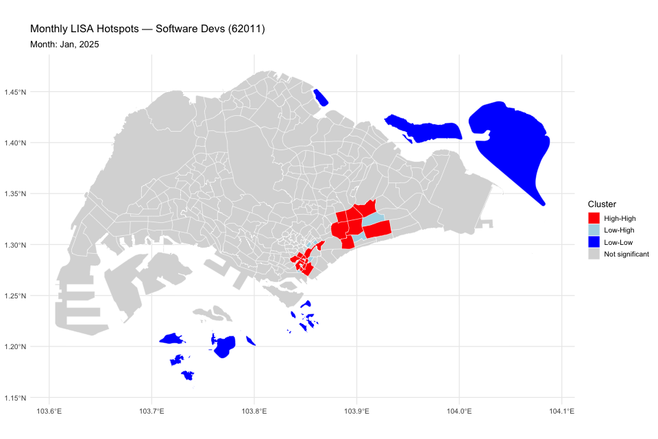

# 1 Introduction & Problem Statement

The locations of businesses and firms are more than just points on a map—they are central to how cities grow, function, and thrive. Where companies choose to set up has ripple effects on economic activity, job creation, and the accessibility of goods and services. A well-placed business not only gains competitive advantages such as proximity to talent, infrastructure, and markets, but also shapes its brand image and visibility. At the same time, these choices influence the broader urban fabric by creating specialized business districts, improving supply chains, and even determining how residents move through the city in their daily commutes. In this way, business locations become both a driver and a reflection of a city’s character and development.

Studying the spatio-temporal patterns of where and when businesses emerge gives us valuable insights into how urban forms evolve. It allows urban planners and policymakers to identify clusters, anticipate growth, and design strategies that encourage efficiency, sustainability, and community well-being. By looking at the establishment of new businesses over time, we can see not just static snapshots but dynamic trends that point toward future possibilities. In this exercise, our focus is on Singapore during the first half of 2025, exploring the patterns and interactions that shape its business landscape.

{fig-align="center"}

## 1.1 Objectives

Through this study, we are investigating the spatial and spatio-temporal patterns of new businesses and firms established in Singapore for the first six months of 2025, with specific goals:

-   Identify ***"where"*** and ***"when"*** of new business entities, revealing clusters, patterns, and trends that are crucial for informed urban planning, resource allocation and economic development.

-   Identify ***complex interaction patterns and emergent phenomena*** in the distribution of new businesses beyond simple proximity or density, such as clustering of related businesses, the influence of past trends on future locations, and the overall structural development of commercial areas, which are crucial for scientific urban planning and policy-making.

## 1.2 General Steps

These are the general steps in this task:

1.  Download ACRA information on Corporate Entities datasets from data.gov.sg

2.  Select at least three business types by referring to 2 or 3-digit Singapore Industrial Classification (SSIS) 2020, which in this task are:

    -   **62011 - DEVELOPMENT OF SOFTWARE AND APPLICATIONS (EXCEPT GAMES AND CYBERSECURITY)**

        -   **Reasons:** Represents Singapore’s digital economy (part of Division 62 – Information & Communications). Less dependent on foot traffic but highly tied to CBD and innovation districts (e.g., One-North, Mapletree Business City). Provides contrast to “brick-and-mortar” businesses.

    -   **47101 - SUPERMARKETS AND HYPERMARKETS**

        -   **Reasons:** Essential retail that reflects catchment area demand. Spatial distribution shows how commercial supply follows residential growth, especially in new towns.

    -   **56111 - RESTAURANTS**

        -   **Reasons**: F&B is highly location-sensitive, clusters visibly in malls, near MRTs, and residential hubs. They influence footfall, nightlife, and urban vibrancy.

3.  Extract the selected business entities registered between 1st January 2024 to 30th June 2025.

4.  Geocode the selected records and convert them into simple point features.

5.  Compute spatial and spatio-temporal KDE of the selected business types.

6.  Perform second order spatial and spatio-temporal analysis on the selected business types.

7.  Describe and discuss the analysis results obtained from Step 5 & Step 6.

8.  For each geovisualisation prepared, write a short report of not more than 150 words describing the spatio-temporal patterns revealed by the geovisualisation and statistical graphics.

9.  With reference to the analysis results above, discuss how these findings can be used to support urban land use planning and management (Not more than 500 words).

# 2. Preparation

## 2.1 Installing Required Packages

```{r}
pacman::p_load(dplyr, lubridate, stringr, tidyverse, sf, httr, ggplot2, dbscan, spdep, rvest, gganimate, leaflet, gifski)
```

| Category | Packages | Purpose/Usage |
|----|----|----|
| **Data Wrangling & Manipulation** | `dplyr`, `lubridate`, `stringr`, `rvest,` `tidyverse` | Data cleaning, transformation, string/date handling (`year()`, `month()`, `str_pad()`), and parsing HTML fields from KML (extracting subzone info). |
| **Spatial Data Handling** | `sf`, `spdep`, `dbscan` | Reading & managing geospatial data (KML, CSV), CRS transformation (EPSG:3414 ↔ EPSG:4326), spatial weights & autocorrelation (Moran’s I, LISA), and density-based clustering (DBSCAN). |
| **Visualization (Static & Animated)** | `ggplot2`, `gganimate`, `gifski` | Choropleths, hotspot maps, clustering visualizations, and animated GIFs of spatio-temporal hotspot evolution. |
| **Interactive Visualization** | `leaflet` | Interactive web maps with zoom, pan, and pop-ups |
| **API & Data Access** | `httr` | Querying OneMap API to geocode postal codes into coordinates. |

## 2.2 Loading and combining ACRA Datas by using wildcards

```{r}

folder_path <- "data/aspatial/acra"
file_list <- list.files(path = folder_path,
                        pattern = "^ACRA*.*\\.csv$",
                        full.names = TRUE)

acra_data <- file_list %>% 
  map_dfr(read_csv)
```

This section loads all ACRA business registration CSV files from the specified folder, combines them into one dataset (`acra_data`), and prepares it for analysis. It ensures multiple files are seamlessly merged, creating a unified dataset of new businesses for further spatial and temporal investigation.

## 2.3 Saving ACRA Data into RDS

```{r}
write_rds(acra_data,
          "data/rds/acra_data.rds")
```

This part saves the combined ACRA dataset into an RDS file, allowing faster loading and efficient storage. Using `write_rds()` ensures the dataset can be easily retrieved later without re-reading and merging the original CSV files, streamlining the workflow for repeated analyses.

## 2.4 Tidying ACRA Data

```{r}
biz_selected <- acra_data %>%
  select(1:24) %>%
  filter(primary_ssic_code %in% c(56111, 47101, 62011)) %>%
  rename(date = registration_incorporation_date) %>%
  mutate(date = as.Date(date),
         YEAR = year(date),
         MONTH_NUM = month(date),
         MONTH_ABBR = month(date, label = TRUE, abbr = TRUE),
         postal_code = str_pad(postal_code, width = 6, side = "left", pad = "0")) %>%
  filter(YEAR == 2025)
```

This code filters ACRA data to focus on three business types (restaurants, supermarkets, software development), standardizes dates and postal codes, and restricts records to the year 2025 as mentioned in the task. It prepares a clean, analysis-ready dataset (`biz_selected`) with consistent formats for temporal and spatial analysis.

## 2.5 Geocoding

```{r}

postcodes <- unique(biz_selected$postal_code)

url <- "https://onemap.gov.sg/api/common/elastic/search"

found <- data.frame()
not_found <- data.frame(postcode = character())

for (pc in postcodes) {
  query <- list(
    searchVal = pc,
    returnGeom = "Y",
    getAddrDetails = "Y",
    pageNum = "1"
  )
  
  res <- GET(url, query = query)
  json <- content(res)
  
  if (json$found != 0) {
    df <- as.data.frame(json$results, stringsAsFactors = FALSE)
    df$input_postcode <- pc
    found <- bind_rows(found, df)
  } else {
    not_found <- bind_rows(not_found, data.frame(postcode = pc))
  }
}
```

This code block geocodes business postal codes using the OneMap API. It extracts unique postal codes from the dataset, sends queries to the API, and retrieves their geographic coordinates and address details. Results are stored in a `found` dataframe, while unmatched codes are tracked in `not_found`.

By looping through all postal codes, the script ensures each business record is linked to its spatial location. This process is crucial for mapping and spatial analysis, enabling businesses to be accurately placed on Singapore’s map and integrated with planning area boundaries for further hotspot, clustering, and spatio-temporal studies.

## 2.6 Tidying the geocoded Data

```{r}
biz_geo <- biz_selected %>%
  left_join(found, by = c("postal_code" = "POSTAL")) %>%
  st_as_sf(coords = c("X", "Y"), crs = 3414)
```

This code links business records with their geocoded postal coordinates, then converts the dataset into a spatial object (`sf`) using EPSG:3414 (Singapore SVY21). It prepares business locations for mapping, spatial analysis, and integration with planning boundaries.

## 2.7 Load URA Subzone Boundary and Processing the KML File

```{r}

mpsz <- st_read("data/geospatial/MasterPlan2019SubzoneBoundaryNoSeaKML.kml",
                quiet = TRUE)

# fix each geometry individually
mpsz$geometry <- lapply(mpsz$geometry, function(g) {
  tryCatch({
    st_make_valid(st_cast(g, "MULTIPOLYGON"))
  }, error = function(e) {
    NULL   # drop if completely broken
  })
}) |> st_sfc(crs = 4326)

mpsz <- st_transform(mpsz, 3414)

#| Tidying KML data with newly created function  

extract_kml_field <- function(html_text, field_name) {
  if(is.na(html_text) || html_text == "") return(NA_character_)
  
  page <- read_html(html_text)
  rows <- page |> html_elements("tr")
  
  value <- rows |>
    keep(~ html_text2(html_element(.x, "th")) == field_name) |> 
    html_element("td") |> 
    html_text2()
  
  if (length(value) == 0) NA_character_ else value
}

mpsz <- mpsz |> 
  mutate(
    REGION_N = map_chr(Description, extract_kml_field, "REGION_N"),
    PLN_AREA_N = map_chr(Description, extract_kml_field, "PLN_AREA_N"),
    SUBZONE_N = map_chr(Description, extract_kml_field, "SUBZONE_N"),
    SUBZONE_C = map_chr(Description, extract_kml_field, "SUBZONE_C")
  ) |> 
  select(-Name, -Description) |> 
  relocate(geometry, .after = last_col())

mpsz
```

This section loads and tidies the Master Plan 2019 Subzone Boundary KML file, which defines Singapore’s planning areas and subzones. Invalid geometries are repaired and converted to multipolygons, then reprojected to EPSG:3414 (SVY21) for consistency with local spatial data.

A custom function parses embedded HTML descriptions to extract key fields such as region, planning area, and subzone names or codes. Redundant columns are dropped, and the geometry is organized for cleaner structure. The resulting dataset (`mpsz`) provides a reliable spatial reference layer, essential for joining business locations to subzones and conducting area-based clustering and spatio-temporal analyses.

## 2.8 Load Resident Population per Subzone

```{r}
pop_raw <- read_csv("data/aspatial/ResidentPopulationbyPlanningAreaSubzoneofResidenceEthnicGroupandSexCensusofPopulation2020.csv")

# check structure
head(pop_raw, 10)
str(pop_raw)

# rename number -> SUBZONE_N
pop_data <- pop_raw %>%
  rename(SUBZONE_N = Number) %>%
  mutate(
    SUBZONE_N  = toupper(SUBZONE_N),        # convert to uppercase
    population = as.numeric(Total_Total)
  ) %>%
  filter(SUBZONE_N != "TOTAL") %>%          
  select(SUBZONE_N, population)

mpsz <- mpsz %>%
  mutate(SUBZONE_N = toupper(SUBZONE_N))    # ensure uppercase


```

This code loads the 2020 Census population dataset and prepares it for integration with spatial data. The “Number” field is renamed as `SUBZONE_N`, standardized to uppercase, and linked with total resident counts.

Totals are excluded, and only subzone-level populations are retained. The `mpsz` layer is also harmonized to uppercase subzone names for accurate joins. This cleaned dataset provides the demographic baseline required for population-normalized business density calculations, ensuring fair comparisons across subzones of varying sizes and populations. It enables planners to evaluate not just business counts, but business accessibility relative to residents.

# 3. Exploratory Data Analysis and Visualization

## 3.1 Plot with Singapore Basemap

```{r}
ggplot() +
  geom_sf(data = mpsz, fill = "grey95", color = "black", size = 0.2) +
  geom_sf(data = biz_geo, aes(color = as.factor(primary_ssic_code)), size = 2, alpha = 0.7) +
  theme_minimal() +
  labs(title = "New Businesses in Singapore (Jan–Jun 2025)",
       subtitle = "SSIC 56111 = Restaurants | 47101 = Supermarkets | 62011 = Software Dev",
       color = "SSIC Code")
```

This code visualizes new businesses on Singapore’s subzone map. The base layer (`mpsz`) shows planning boundaries in grey, while business points (`biz_geo`) are overlaid and color-coded by SSIC code (restaurants, supermarkets, software development). The map highlights spatial distribution patterns across subzones, providing a clear overview of business clustering.

## 3.2 Assign Each Business to a Subzone

```{r}
biz_geo_subzone <- st_join(biz_geo, mpsz, join = st_within)

head(biz_geo_subzone %>%
       st_drop_geometry() %>%
       select(primary_ssic_code, postal_code, SUBZONE_N, PLN_AREA_N))

biz_counts <- biz_geo_subzone %>%
  st_drop_geometry() %>%
  group_by(PLN_AREA_N, SUBZONE_N, primary_ssic_code) %>%
  tally(name = "n_businesses")
```

This code links each business point to its subzone by performing a spatial join with `mpsz`. The resulting dataset associates businesses with their planning area and subzone.

After dropping geometries, businesses are grouped by area, subzone, and SSIC code, with counts (`n_businesses`) calculated. This forms the basis for subzone-level analysis.

## 3.3 Joins Counts Back to Polygons and Choropleth Mapping

```{r}

subzones_list <- mpsz %>% st_drop_geometry() %>% distinct(SUBZONE_N, PLN_AREA_N)
ssic_list <- tibble(primary_ssic_code = c(56111, 47101, 62011))

all_combos <- crossing(subzones_list, ssic_list)

biz_counts <- biz_geo_subzone %>%
  st_drop_geometry() %>%
  group_by(SUBZONE_N, PLN_AREA_N, primary_ssic_code) %>%
  tally(name = "n_businesses")

biz_counts_full <- all_combos %>%
  left_join(biz_counts, by = c("SUBZONE_N", "PLN_AREA_N", "primary_ssic_code")) %>%
  mutate(n_businesses = ifelse(is.na(n_businesses), 0, n_businesses))

mpsz_biz <- mpsz %>%
  left_join(biz_counts_full, by = c("SUBZONE_N", "PLN_AREA_N"))

```

This code ensures a complete business–subzone dataset for analysis. It first generates all possible combinations of subzones and SSIC codes, then counts businesses per subzone. Missing values are filled with zeros, guaranteeing full coverage. Finally, results are joined back to `mpsz`, producing a spatial layer (`mpsz_biz`) for choropleth mapping and comparison.

### 3.3.1 Choropleth Map for New Businesses - Restaurants (56111)

```{r}

p_rest <- ggplot(filter(mpsz_biz, primary_ssic_code == 56111)) +
  geom_sf(aes(fill = n_businesses), color = "white", size = 0.2) +
  scale_fill_gradient(
    low = "#08306b",   # dark blue (low density)
    high = "#deebf7",  # light blue (high density)
    na.value = "grey90"
  ) +
  theme_minimal(base_size = 16) +
  labs(
    title = "New Restaurants by Subzone (Jan–Jun 2025)",
    subtitle = "SSIC 56111 = Restaurants",
    fill = "No. of Businesses"
  )
p_rest
```

The choropleth map shows the distribution of **new restaurant registrations (SSIC 56111) across Singapore’s subzones between January and June 2025**.

-   **Dark blue subzones (low counts: 0–5 restaurants)** dominate most of the island, indicating relatively few new restaurants. This is expected in largely residential or industrial areas where demand for food services is lower.

-   **Medium blue subzones (10–20 restaurants)** appear in areas with higher population density and mixed commercial activity, such as parts of Bukit Merah, Toa Payoh, and Tampines.

-   **Lightest blue hotspots (20+ restaurants)** are clustered near the city core — Downtown Core, Orchard, Bugis, and parts of Geylang. These zones are well-known for food culture, nightlife, and tourism, making them attractive for restaurant businesses.

***Summary Insights:***

-   **Concentration in central areas**: High-density clusters of new restaurants align with established dining belts and tourist/office districts.

-   **Suburban growth**: Moderate openings in housing estates suggest demand is spreading out, likely catering to residents’ convenience.

-   **Sparse coverage**: Northern and western regions remain underrepresented, reflecting either lower demand (due to western and northern side being more industrial locations) or barriers to entry (rental costs, zoning).

### 3.3.2 Choropleth Map for New Businesses - Supermarkets (47101)

```{r}
p_super <- ggplot(filter(mpsz_biz, primary_ssic_code == 47101)) +
  geom_sf(aes(fill = n_businesses), color = "white", size = 0.2) +
  scale_fill_gradient(
    low = "#08306b",
    high = "#deebf7",
    na.value = "grey90"
  ) +
  theme_minimal(base_size = 16) +
  labs(
    title = "New Supermarkets by Subzone (Jan–Jun 2025)",
    subtitle = "SSIC 47101 = Supermarkets",
    fill = "No. of Businesses"
  )
p_super

```

This map illustrates the distribution of **new supermarkets (SSIC 47101)** across Singapore subzones during January–June 2025.

-   Most subzones show **very low counts (0–2)**, with only a few subzones registering more than 5 supermarkets.

-   Unlike restaurants, supermarkets follow a **dispersed spatial pattern**, reflecting their role as essential services distributed evenly to serve residential populations.

-   Denser openings appear in **new housing estates or growth areas**, suggesting supermarkets are expanding where residential demand is rising.

-   Central business districts show **fewer new entries**, consistent with supermarkets being oriented toward neighborhoods rather than office or leisure zones.

***Summary Insights:*** Supermarkets shows a **service-coverage strategy**, ensuring accessibility across many subzones rather than clustering tightly in commercial (i.e. CBD/tourism) hotspots.

### 3.3.3 Choropleth Map for New Businesses - Software Devs (62011)

```{r}
p_soft <- ggplot(filter(mpsz_biz, primary_ssic_code == 62011)) +
  geom_sf(aes(fill = n_businesses), color = "white", size = 0.2) +
  scale_fill_gradient(
    low = "#08306b",
    high = "#deebf7",
    na.value = "grey90"
  ) +
  theme_minimal(base_size = 16) +
  labs(
    title = "New Software Development by Subzone (Jan–Jun 2025)",
    subtitle = "SSIC 62011 = Software Dev",
    fill = "No. of Businesses"
  )
p_soft

```

This map shows the distribution of **new software development firms (SSIC 62011)** across Singapore’s subzones for January–June 2025.

-   Registrations are **heavily concentrated** in specific subzones, with clusters in **Downtown Core, One-North, and Changi Business Park**, which are established technology and innovation hubs.

-   Most subzones show **little to no activity**, reflecting the sector’s dependence on specialized ecosystems, talent pools, and infrastructure rather than broad geographic coverage.

-   Compared with restaurants and supermarkets, software firms exhibit **strong clustering**, consistent with agglomeration economies in the tech sector.

***Summary Insights:*** Software development businesses revolves towards established innovation districts, reinforcing existing hubs rather than creating new clusters.

# 4. Business Density Relative to Population or Land Area

## 4.1 Business Density with Normalised-Area (No of Business per km^2^)

-   Compute area of each subzone (`st_area()`)

-   Choropleths show spatial intensity of businesses per unit land area.

-   Research question: *Which areas are becoming dense commercial clusters, regardless of population?*

### 4.1.1 Compute Subzone Area

```{r}
mpsz <- mpsz %>%
  mutate(area_km2 = as.numeric(st_area(geometry)) / 1e6)
```

### 4.1.2 Calculate Density (No of Business per km^2^)

```{r}
mpsz_biz_density <- mpsz_biz %>%
  mutate(
    area_km2 = as.numeric(st_area(geometry)) / 1e6,
    biz_density = n_businesses / area_km2
  )
```

### 4.1.3 Choropleth of Density (Faceted)

```{r}

#| fig.width: 10
#| fig.height: 20

mpsz_biz_density <- mpsz_biz_density %>%
  mutate(
    density_bin = cut(
      biz_density,
      breaks = c(0, 10, 20, 30, 40, 50, 60, 70, 80, 90, 100, Inf),
      labels = c("0–10", "10–20", "20–30", "30–40", "40–50",
                 "50–60", "60–70", "70–80", "80–90", "90–100", ">100"),
      include.lowest = TRUE,
      right = TRUE
    )
  )

# Shared color scale
fill_scale <- scale_fill_brewer(
  palette = "PuOr",
  na.value = "grey90",
  drop = FALSE
)

```

Using fixed bins and a shared palette standardizes interpretation across business types, allowing restaurants, supermarkets, and software firms to be directly compared in terms of subzone-level business density.

#### 4.1.3.1 Choropleth of Density - Restaurants (56111 - No of Business per km^2^)

```{r}
# Restaurants (56111)
p_rest <- ggplot(filter(mpsz_biz_density, primary_ssic_code == 56111)) +
  geom_sf(aes(fill = density_bin), color = "white", size = 0.2) +
  scale_fill_manual(
    values = rev(colorRampPalette(c("#deebf7", "#08306b"))(11)), # dark → light blue
    na.value = "grey90",
    drop = FALSE
  ) +
  theme_minimal(base_size = 16) +
  labs(
    title = "New Restaurant Density by Subzone (Jan–Jun 2025)",
    subtitle = "SSIC 56111 = Restaurants",
    fill = "Businesses / km²"
  )
p_rest

```

This map shows the **density of new restaurants (per km²) by subzone** from January–June 2025.

-   **Light blue subzones** indicate **high restaurant density**, concentrated in central commercial areas such as Downtown Core, Orchard, and Bugis.

-   **Darker blue subzones** represent **lower density**, typical of peripheral or industrial areas with fewer food establishments per land area.

-   Using density rather than raw counts highlights where restaurants are truly concentrated relative to land size, revealing **competitive hotspots** and accessibility differences.

***Summary Insights:*** Light blue hotspots in the city core suggest strong clustering and agglomeration effects, while darker shades highlight under-served or less commercially attractive areas.

#### 4.1.3.2 Choropleth of Density - Supermarkets (47101 - No of Business per km^2^)

```{r}
# Supermarkets (47101)
p_rest <- ggplot(filter(mpsz_biz_density, primary_ssic_code == 47101)) +
  geom_sf(aes(fill = density_bin), color = "white", size = 0.2) +
  scale_fill_manual(
    values = rev(colorRampPalette(c("#deebf7", "#08306b"))(11)), # dark → light blue
    na.value = "grey90",
    drop = FALSE
  ) +
  theme_minimal(base_size = 16) +
  labs(
    title = "New Supermarket Density by Subzone (Jan–Jun 2025)",
    subtitle = "SSIC 47101 = Supermarkets",
    fill = "Businesses / km²"
  )
p_rest

```

This map displays the **density of new supermarkets (per km²)** registered between January and June 2025.

-   **Light blue subzones** indicate **higher supermarket density**, typically appearing in residential growth areas or newer estates where demand is strong.

-   **Darker blue areas** represent **lower density**, covering most subzones since supermarkets are deliberately dispersed to ensure broad service coverage rather than clustering.

-   Unlike restaurants, supermarkets show a **spread-out pattern**, aligning with their role as essential amenities serving local populations instead of concentrating in commercial hubs.

***Summary Insights:*** Supermarkets prioritize equitable geographic access, with fewer dense hotspots and more even distribution across housing subzones.

#### 4.1.3.3 Choropleth of Density - Software Devs (62011 - No of Business per km^2^)

```{r}
#Software Dev (62011)
p_rest <- ggplot(filter(mpsz_biz_density, primary_ssic_code == 62011)) +
  geom_sf(aes(fill = density_bin), color = "white", size = 0.2) +
  scale_fill_manual(
    values = rev(colorRampPalette(c("#deebf7", "#08306b"))(11)), # dark → light blue
    na.value = "grey90",
    drop = FALSE
  ) +
  theme_minimal(base_size = 16) +
  labs(
    title = "New Software Dev Density by Subzone (Jan–Jun 2025)",
    subtitle = "SSIC 62011 = Software Devs",
    fill = "Businesses / km²"
  )
p_rest

```

This map shows the **density of new software development firms (per km²)** established from January–June 2025.

-   **Light blue subzones** highlight **high-density clusters**, mainly in innovation and business districts such as **Downtown Core, One-North, and Changi Business Park**.

-   **Darker blue areas** reflect **little to no activity**, which dominates most residential and peripheral zones.

-   Compared with restaurants and supermarkets, software firms exhibit **specialized clustering**, concentrating in ecosystems with strong talent pools, digital infrastructure, and industry linkages.

***Summary Insights:*** Software firms reinforce existing innovation hubs, demonstrating **path-dependent agglomeration**, rather than dispersing widely across Singapore.

## 4.2 Business Density with Normalised-Population Dataset

### 4.2.1 Compute Population-Normalised Business Counts

```{r}
mpsz_biz_pop <- mpsz_biz %>%
  left_join(pop_data, by = "SUBZONE_N") %>%
  mutate(
    biz_per_1000 = ifelse(population > 0,
                          (n_businesses / population) * 1000,
                          NA)
  )
```

### 4.2.2 Population - Normalised Business Counts - Restaurants (56111)

```{r}
p_rest_pop <- ggplot(filter(mpsz_biz_pop, primary_ssic_code == 56111)) +
  geom_sf(aes(fill = biz_per_1000), color = "white", size = 0.2) +
  scale_fill_gradient(
    low = "#08306b",   # dark blue = fewer per 1k residents
    high = "#deebf7",  # light blue = more per 1k residents
    na.value = "grey90"
  ) +
  theme_minimal(base_size = 16) +
  labs(
    title = "Restaurants per 1,000 Residents (Jan–Jun 2025)",
    subtitle = "SSIC 56111 = Restaurants",
    fill = "Businesses / 1,000 Residents"
  )
p_rest_pop
```

This map shows the **number of new restaurants per 1,000 residents** across Singapore’s subzones (Jan–Jun 2025).

-   **Light blue subzones** indicate **more restaurants relative to local population size**, suggesting strong service availability or concentration beyond residential demand (e.g., city core, tourist, or lifestyle districts).

-   **Dark blue subzones** show **fewer restaurants per resident**, often in large housing estates or lower-demand zones.

-   By adjusting for population, this map highlights **service accessibility**, distinguishing between sheer clustering of businesses and how well they scale to meet local demand.

***Summary Insights:*** Central zones remain overserved relative to population, while surrounding estates are under-served despite growing residential bases.

**Disclaimer**: This doesn't applicable to Mandai, Jurong Islands, etc. since these area might have very limited number of residence (or None).

### 4.2.3 Population - Normalised Business Counts - Supermarkets (47101)

```{r}
p_super_pop <- ggplot(filter(mpsz_biz_pop, primary_ssic_code == 47101)) +
  geom_sf(aes(fill = biz_per_1000), color = "white", size = 0.2) +
  scale_fill_gradient(
    low = "#08306b",
    high = "#deebf7",
    na.value = "grey90"
  ) +
  theme_minimal(base_size = 16) +
  labs(
    title = "Supermarkets per 1,000 Residents (Jan–Jun 2025)",
    subtitle = "SSIC 47101 = Supermarkets",
    fill = "Businesses / 1,000 Residents"
  )
p_super_pop

```

This map shows the **number of new supermarkets per 1,000 residents** across subzones in Jan–Jun 2025.

-   **Light blue subzones** indicate **more supermarkets relative to population**, often in new growth areas or smaller subzones where each outlet serves fewer residents.

-   **Dark blue subzones** reflect **fewer supermarkets per capita**, typical in larger or mature estates where a small number of outlets must serve many residents.

-   Unlike restaurants, supermarkets maintain a **balanced distribution**, but population-normalisation highlights service gaps where access may be stretched.

***Summary Insights:*** Coverage is generally even, but some dense residential subzones may be under-served relative to population size.

**Disclaimer**: This doesn't applicable to Mandai, Jurong Islands, etc. since these area might have very limited number of residence (or None).

### 4.2.4 Population - Normalised Business Counts - Software Devs (62011)

```{r}
p_soft_pop <- ggplot(filter(mpsz_biz_pop, primary_ssic_code == 62011)) +
  geom_sf(aes(fill = biz_per_1000), color = "white", size = 0.2) +
  scale_fill_gradient(
    low = "#08306b",
    high = "#deebf7",
    na.value = "grey90"
  ) +
  theme_minimal(base_size = 16) +
  labs(
    title = "Software Development per 1,000 Residents (Jan–Jun 2025)",
    subtitle = "SSIC 62011 = Software Dev",
    fill = "Businesses / 1,000 Residents"
  )
p_soft_pop

```

This map presents the **number of new software development firms per 1,000 residents** by subzone for Jan–Jun 2025.

-   **Light blue subzones** indicate **more firms relative to resident population**, concentrated in business and innovation districts like **Downtown Core, One-North, and Changi Business Park**, which attract firms regardless of residential density.

-   **Dark blue subzones** show **very few or no firms per capita**, covering most residential estates.

-   Unlike restaurants or supermarkets, software firms align with **talent pools and infrastructure** rather than population size.

***Summary Insights:*** High per-capita concentrations in innovation hubs reinforce Singapore’s knowledge economy, while residential zones remain almost entirely unserved.

**Disclaimer**: This doesn't applicable to Mandai, Jurong Islands, etc. since these area might have very limited number of residence (or None).

# 5. Spatial Clustering

## 5.1 Spatial Clustering by Business

### 5.1.1 Restaurant (56111)

```{r}
rest_data <- mpsz_biz_pop %>%
  filter(primary_ssic_code == 56111 & !is.na(biz_per_1000))

nb <- poly2nb(rest_data)
lw <- nb2listw(nb, style = "W", zero.policy = TRUE)

lisa <- localmoran(rest_data$biz_per_1000, lw, zero.policy = TRUE)

rest_data$lisa_I   <- lisa[, 1]   # local Moran's I value
rest_data$lisa_p   <- lisa[, 5]   # p-value

which(card(nb) == 0)
rest_data$SUBZONE_N[card(nb) == 0]
```

```{r}
rest_data$cluster <- case_when(
  rest_data$lisa_p > 0.05 ~ "Not significant",
  rest_data$biz_per_1000 > mean(rest_data$biz_per_1000, na.rm = TRUE) & lag.listw(lw, rest_data$biz_per_1000, zero.policy = TRUE) > mean(rest_data$biz_per_1000, na.rm = TRUE) ~ "High-High",
  rest_data$biz_per_1000 < mean(rest_data$biz_per_1000, na.rm = TRUE) & lag.listw(lw, rest_data$biz_per_1000, zero.policy = TRUE) < mean(rest_data$biz_per_1000, na.rm = TRUE) ~ "Low-Low",
  rest_data$biz_per_1000 > mean(rest_data$biz_per_1000, na.rm = TRUE) & lag.listw(lw, rest_data$biz_per_1000, zero.policy = TRUE) < mean(rest_data$biz_per_1000, na.rm = TRUE) ~ "High-Low",
  rest_data$biz_per_1000 < mean(rest_data$biz_per_1000, na.rm = TRUE) & lag.listw(lw, rest_data$biz_per_1000, zero.policy = TRUE) > mean(rest_data$biz_per_1000, na.rm = TRUE) ~ "Low-High",
  TRUE ~ "Not significant"
)
```

```{r}
ggplot(rest_data) +
  geom_sf(aes(fill = cluster), color = "white", size = 0.2) +
  scale_fill_manual(
    values = c(
      "High-High" = "red",
      "Low-Low" = "blue",
      "High-Low" = "orange",
      "Low-High" = "lightblue",
      "Not significant" = "grey80"
    )
  ) +
  theme_minimal(base_size = 14) +
  labs(
    title = "Local Moran’s I Cluster Map - Restaurants (56111)",
    subtitle = "Businesses per 1,000 residents, Jan–Jun 2025",
    fill = "Cluster Type"
  )

```

This code applies **Local Moran’s I** to detect statistically significant clusters of restaurant density (per 1,000 residents) across subzones.

-   Subzones are classified as:

    -   **High-High (red):** Hotspots with high restaurant density surrounded by similar high-density neighbors.

    -   **Low-Low (blue):** Cold spots with low density adjacent to low-density areas.

    -   **Low-High (light blue):** Outliers where a low-density subzone is surrounded by high-density areas.

    -   **Not significant (grey):** No clear spatial autocorrelation.

**Interpretation:** This map highlights **hotspots in central dining districts** and **cold spots in surrounding residential areas**, with some interesting outliers that may reflect emerging or under-served markets.

### 5.1.2 Supermarkets (47101)

```{r}
rest_data <- mpsz_biz_pop %>%
  filter(primary_ssic_code == 47101 & !is.na(biz_per_1000))

nb <- poly2nb(rest_data)
lw <- nb2listw(nb, style = "W", zero.policy = TRUE)

lisa <- localmoran(rest_data$biz_per_1000, lw, zero.policy = TRUE)

rest_data$lisa_I   <- lisa[, 1]   # local Moran's I value
rest_data$lisa_p   <- lisa[, 5]   # p-value

which(card(nb) == 0)
rest_data$SUBZONE_N[card(nb) == 0]
```

```{r}
rest_data$cluster <- case_when(
  rest_data$lisa_p > 0.05 ~ "Not significant",
  rest_data$biz_per_1000 > mean(rest_data$biz_per_1000, na.rm = TRUE) & lag.listw(lw, rest_data$biz_per_1000, zero.policy = TRUE) > mean(rest_data$biz_per_1000, na.rm = TRUE) ~ "High-High",
  rest_data$biz_per_1000 < mean(rest_data$biz_per_1000, na.rm = TRUE) & lag.listw(lw, rest_data$biz_per_1000, zero.policy = TRUE) < mean(rest_data$biz_per_1000, na.rm = TRUE) ~ "Low-Low",
  rest_data$biz_per_1000 > mean(rest_data$biz_per_1000, na.rm = TRUE) & lag.listw(lw, rest_data$biz_per_1000, zero.policy = TRUE) < mean(rest_data$biz_per_1000, na.rm = TRUE) ~ "High-Low",
  rest_data$biz_per_1000 < mean(rest_data$biz_per_1000, na.rm = TRUE) & lag.listw(lw, rest_data$biz_per_1000, zero.policy = TRUE) > mean(rest_data$biz_per_1000, na.rm = TRUE) ~ "Low-High",
  TRUE ~ "Not significant"
)
```

```{r}
ggplot(rest_data) +
  geom_sf(aes(fill = cluster), color = "white", size = 0.2) +
  scale_fill_manual(
    values = c(
      "High-High" = "red",
      "Low-Low" = "blue",
      "High-Low" = "orange",
      "Low-High" = "lightblue",
      "Not significant" = "grey80"
    )
  ) +
  theme_minimal(base_size = 14) +
  labs(
    title = "Local Moran’s I Cluster Map - Supermarkets (47101)",
    subtitle = "Businesses per 1,000 residents, Jan–Jun 2025",
    fill = "Cluster Type"
  )

```

This analysis applies **Local Moran’s I** to supermarket density per 1,000 residents, identifying spatial autocorrelation patterns across Singapore’s subzones.

-   **Low-Low (blue):** Areas with consistently low supermarket coverage, typically in mature estates where growth is slower.

-   **Low-High (light blue):** Outliers where service provision is mismatched relative to neighboring areas, highlighting potential planning imbalances.

-   **Not significant (grey):** Subzones with no clear clustering pattern.

**Interpretation:** Unlike restaurants, supermarkets show weaker clustering, reflecting a **distribution strategy focused on broad service coverage** rather than concentrated hotspots. Still, LISA identifies pockets where residents may be relatively underserved compared to nearby subzones.

### 5.1.3 Software Devs (62011)

```{r}
rest_data <- mpsz_biz_pop %>%
  filter(primary_ssic_code == 62011 & !is.na(biz_per_1000))

nb <- poly2nb(rest_data)
lw <- nb2listw(nb, style = "W", zero.policy = TRUE)

lisa <- localmoran(rest_data$biz_per_1000, lw, zero.policy = TRUE)

rest_data$lisa_I   <- lisa[, 1]   # local Moran's I value
rest_data$lisa_p   <- lisa[, 5]   # p-value

which(card(nb) == 0)
rest_data$SUBZONE_N[card(nb) == 0]
```

```{r}
rest_data$cluster <- case_when(
  rest_data$lisa_p > 0.05 ~ "Not significant",
  rest_data$biz_per_1000 > mean(rest_data$biz_per_1000, na.rm = TRUE) & lag.listw(lw, rest_data$biz_per_1000, zero.policy = TRUE) > mean(rest_data$biz_per_1000, na.rm = TRUE) ~ "High-High",
  rest_data$biz_per_1000 < mean(rest_data$biz_per_1000, na.rm = TRUE) & lag.listw(lw, rest_data$biz_per_1000, zero.policy = TRUE) < mean(rest_data$biz_per_1000, na.rm = TRUE) ~ "Low-Low",
  rest_data$biz_per_1000 > mean(rest_data$biz_per_1000, na.rm = TRUE) & lag.listw(lw, rest_data$biz_per_1000, zero.policy = TRUE) < mean(rest_data$biz_per_1000, na.rm = TRUE) ~ "High-Low",
  rest_data$biz_per_1000 < mean(rest_data$biz_per_1000, na.rm = TRUE) & lag.listw(lw, rest_data$biz_per_1000, zero.policy = TRUE) > mean(rest_data$biz_per_1000, na.rm = TRUE) ~ "Low-High",
  TRUE ~ "Not significant"
)
```

```{r}
ggplot(rest_data) +
  geom_sf(aes(fill = cluster), color = "white", size = 0.2) +
  scale_fill_manual(
    values = c(
      "High-High" = "red",
      "Low-Low" = "blue",
      "High-Low" = "orange",
      "Low-High" = "lightblue",
      "Not significant" = "grey80"
    )
  ) +
  theme_minimal(base_size = 14) +
  labs(
    title = "Local Moran’s I Cluster Map - Restaurants (56111)",
    subtitle = "Businesses per 1,000 residents, Jan–Jun 2025",
    fill = "Cluster Type"
  )

```

This analysis applies **Local Moran’s I** to software development firm density (per 1,000 residents), detecting spatial clusters across Singapore.

-   **High-High (red):** Strong clusters in innovation hubs such as **Downtown Core, One-North, and Changi Business Park**, where high concentrations of firms are surrounded by similarly dense neighbors.

-   **Low-Low (blue):** Large residential and peripheral subzones with consistently low or no software presence.

-   **Low-High (light blue):** Outliers suggesting emerging tech nodes or underserved subzones adjacent to innovation hubs.

-   **Not significant (grey):** Areas with no clear spatial autocorrelation.

**Interpretation:** Software firms show the **strongest clustering effect** of all three business types, reinforcing path-dependent innovation ecosystems rather than broad geographic distribution.

## 5.2 Spatio Temporal Trends (Jan - June 2025)

```{r}
biz_geo <- biz_geo %>%
  mutate(
    month = format(date, "%b %Y")  # e.g. "Jan 2025", "Feb 2025"
  )

base_map <- ggplot() +
  geom_sf(data = mpsz, fill = "grey95", color = "white", size = 0.2) +
  theme_minimal()

```

```{r}

p_anim <- base_map +
  geom_sf(
    data = biz_geo,
    aes(color = factor(primary_ssic_code)),
    size = 2, alpha = 0.7
  ) +
  scale_color_manual(
    values = c("56111" = "#1f78b4",   # Restaurants
               "47101" = "#33a02c",   # Supermarkets
               "62011" = "#e31a1c")   # Software Dev
  ) +
  labs(
    title = "New Business Registrations in Singapore",
    subtitle = "Month: {closest_state}",
    color = "SSIC Code"
  ) +
  transition_states(month, transition_length = 2, state_length = 1) +
  ease_aes("linear")
```

```{r}
#| eval: false
anim <- animate(
  p_anim,
  nframes = 100,
  fps = 10,
  width = 800,
  height = 600,
  renderer = gifski_renderer()
)
anim

anim_save("images/new_business_anim.gif", animation = anim)
```

{fig-align="center"}

This code creates an animated map of **new business registrations (restaurants, supermarkets, and software firms) across Singapore** from Jan–Jun 2025.

-   Each month is represented as a separate animation frame, showing how new businesses emerge over time.

-   Businesses are color-coded: **blue = restaurants (56111)**, **green = supermarkets (47101)**, and **red = software development (62011)**.

-   The animation highlights both the **temporal evolution** (when businesses are registered) and **spatial clustering** (where they emerge).

***Summary Insights:*** This dynamic view reveals **month-to-month growth patterns**, making it easier to observe surges in activity, emerging clusters, and differences in sectoral expansion across subzones.

```{r}
biz_summary <- biz_geo_subzone %>%
  mutate(
    YEAR = year(date),
    MONTH = month(date, label = TRUE, abbr = TRUE)
  ) %>%
  filter(YEAR == 2025) %>%
  group_by(primary_ssic_code, MONTH) %>%
  summarise(total_new = n(), .groups = "drop") %>%
  pivot_wider(
    names_from = MONTH,
    values_from = total_new,
    values_fill = 0
  )
print(biz_summary, n = 20)
```

```{r}

biz_trends <- biz_geo_subzone %>%
  mutate(
    YEAR = year(date),
    MONTH = month(date, label = TRUE, abbr = TRUE)
  ) %>%
  filter(YEAR == 2025) %>%
  group_by(SUBZONE_N, primary_ssic_code, MONTH) %>%
  summarise(n_new = n(), .groups = "drop") %>%
  pivot_wider(
    names_from = MONTH,
    values_from = n_new,
    values_fill = 0
  )

print(biz_trends, n = 20)

```

```{r}
biz_summary <- biz_geo_subzone %>%
  mutate(
    YEAR = year(date),
    MONTH = month(date, label = TRUE, abbr = TRUE)
  ) %>%
  filter(YEAR == 2025) %>%
  group_by(primary_ssic_code, MONTH) %>%
  summarise(total_new = n(), .groups = "drop") %>%
  pivot_wider(
    names_from = MONTH,
    values_from = total_new,
    values_fill = 0
  )

print(biz_summary)

```

This code generates two different **temporal summaries** of new business registrations for 2025.

1.  **`biz_summary` (sector-level trends):**

    -   Groups by SSIC code and month.

    -   Produces a table showing the number of new registrations per business type each month.

    -   Useful for **comparing overall monthly growth across sectors** (restaurants, supermarkets, software).

2.  **`biz_trends` (subzone-level trends):**

    -   Groups by subzone, SSIC code, and month.

    -   Produces a wide-format table of monthly counts for each business type within each subzone.

    -   Useful for detecting **spatio-temporal variation**, e.g., which subzones experience bursts of new activity.

***Summary Insights:*** Together, these summaries highlight both **broad sectoral growth patterns** and **local subzone-level dynamics**, enabling planners to see how business activity evolves over time and across space.

## 5.3 Trends Across Business Types

```{r}
biz_summary <- biz_geo_subzone %>%
  st_drop_geometry() %>%   # drop sf geometry, keep attributes
  mutate(
    YEAR = year(date),
    MONTH = month(date, label = TRUE, abbr = TRUE)
  ) %>%
  filter(YEAR == 2025) %>%
  group_by(primary_ssic_code, MONTH) %>%
  summarise(total_new = n(), .groups = "drop") %>%
  pivot_wider(
    names_from = MONTH,
    values_from = total_new,
    values_fill = 0
  )

biz_summary_long <- biz_summary %>%
  pivot_longer(cols = -primary_ssic_code, names_to = "Month", values_to = "Count") %>%
  mutate(
    Month = factor(Month, levels = c("Jan", "Feb", "Mar", "Apr", "May", "Jun", "Jul"))
  )

ggplot(biz_summary_long, aes(x = Month, y = Count, color = primary_ssic_code, group = primary_ssic_code)) +
  geom_line(size = 1.2) +
  geom_point(size = 2) +
  theme_minimal() +
  labs(title = "Monthly Trends of New Businesses (2025)",
       x = "Month", y = "New Registrations", color = "SSIC Code")

biz_summary_long
```

This code summarizes and visualizes **monthly new business registrations in 2025**.

-   `biz_summary` creates a wide-format table of counts per SSIC code and month.

-   It is reshaped (`pivot_longer`) into `biz_summary_long` for plotting.

-   A line chart shows monthly trends, with each SSIC code represented by a separate line.

**Interpretation:** The chart makes it easy to spot sectoral differences — for example, whether restaurants (56111) cluster in certain months, supermarkets (47101) maintain steady entries, or software development firms (62011) surge in specific periods.

# 6. Emergent Point Clusters (with DBSCAN on business points)

## 6.1 Business Clusters - Restaurants (56111)

```{r}

ssic_pick <- 56111

pts <- biz_geo_subzone %>%
  dplyr::filter(primary_ssic_code == ssic_pick)

# coordinates in meters (EPSG:3414)
XY <- sf::st_coordinates(pts)

# --- Test cluster counts across different eps ---
for (e in c(500, 700, 900, 1100)) {
  db <- dbscan::dbscan(XY, eps = e, minPts = 10)  # stricter minPts
  cat("eps =", e, " → clusters:", length(unique(db$cluster))-1, "\n")
}

# --- Pick one eps/minPts combination for plotting ---
db <- dbscan::dbscan(XY, eps = 1100, minPts = 10)  
pts$cluster_db <- factor(db$cluster)  

# --- Plot ---
ggplot() +
  geom_sf(data = mpsz, fill = "grey95", color = "white", size = 0.2) +
  geom_sf(data = pts, aes(color = cluster_db), size = 1.8, alpha = 0.8) +
  labs(
    title = "DBSCAN clusters (56111)",
    subtitle = "eps = 700 m, minPts = 10; cluster 0 = noise",
    color = "Cluster"
  ) +
  theme_minimal(base_size = 14)

```

```{r}
kNNdistplot(XY, k = 6)  

```

This analysis applies **DBSCAN clustering** to restaurant locations (SSIC 56111) using coordinates projected in meters (EPSG:3414). By testing different neighborhood radii (`eps = 500–1100m`), we assess how sensitive clustering is to distance thresholds. The final model uses **eps = 1100m** with a minimum of 10 points per cluster, balancing sensitivity to true clusters against noise.

The resulting map highlights **distinct clusters of restaurants** in central and lifestyle districts, where businesses are densely packed, while points outside these clusters are labeled as noise (cluster 0). The **kNN distance plot** supports the chosen parameter by showing where the “elbow” occurs in nearest-neighbor distances.

***Summary Insights:*** DBSCAN reveals clear **restaurant agglomeration in city-core subzones**, confirming the role of central areas as dining hubs. Surrounding restaurants remain more scattered, reflecting demand-driven but less clustered activity.

## 6.2 Business Clusters - Supermarkets (47101)

```{r}
ssic_pick <- 47101
pts <- biz_geo_subzone %>% filter(primary_ssic_code == ssic_pick)
XY <- st_coordinates(pts)

db <- dbscan::dbscan(XY, eps = 500, minPts = 3)  
pts$cluster_db <- factor(db$cluster)

ggplot() +
  geom_sf(data = mpsz, fill = "grey95", color = "white", size = 0.2) +
  geom_sf(data = pts, aes(color = cluster_db), size = 2, alpha = 0.8) +
  labs(
    title = "DBSCAN clusters (47101 - Supermarkets)",
    subtitle = "eps = 500 m, minPts = 4",
    color = "Cluster"
  ) +
  theme_minimal(base_size = 14)

```

```{r}
kNNdistplot(XY, k = 6)  
```

This analysis applies **DBSCAN clustering** to supermarket locations (SSIC 47101). Using projected coordinates (EPSG:3414), the model was run with **eps = 500m** and **minPts = 3** to test for spatial concentration. Unlike restaurants, the resulting clusters are **sparse and limited**, with many points classified as noise.

The **map** shows supermarkets dispersed across subzones, reflecting their function as essential neighborhood services rather than agglomerated businesses. The **kNN distance plot** suggests no strong distance threshold for natural clustering, further supporting this dispersed pattern.

***Summary Insights:*** Supermarkets exhibit a **distribution-oriented strategy**, ensuring broad residential coverage with minimal clustering, contrasting with the strong agglomeration observed in restaurants.

## 6.3 Business Clusters - Software Devs (62011)

```{r}
ssic_pick <- 62011
pts <- biz_geo_subzone %>% filter(primary_ssic_code == ssic_pick)
XY <- st_coordinates(pts)

# test cluster counts for different eps
for (e in c(500, 700, 900, 1100)) {
  db <- dbscan::dbscan(XY, eps = e, minPts = 8)  # slightly stricter than restaurants
  cat("eps =", e, " → clusters:", length(unique(db$cluster))-1, "\n")
}

# choose eps ~700–900 based on elbow or test results
db <- dbscan::dbscan(XY, eps = 1000, minPts = 8)
pts$cluster_db <- factor(db$cluster)

# plot
ggplot() +
  geom_sf(data = mpsz, fill = "grey95", color = "white", size = 0.2) +
  geom_sf(data = pts, aes(color = cluster_db), size = 2, alpha = 0.8) +
  labs(
    title = "DBSCAN clusters (62011 - Software Development)",
    subtitle = "eps = 800 m, minPts = 8; cluster 0 = noise",
    color = "Cluster"
  ) +
  theme_minimal(base_size = 14)

```

```{r}
kNNdistplot(XY, k = 6)
```

This analysis uses **DBSCAN clustering** on software development firms (SSIC 62011) with projected coordinates (EPSG:3414). Several distance thresholds (`eps = 500–1100m`) were tested with a stricter **minPts = 8**, reflecting the expectation that tech hubs form only with multiple firms. The final model applied **eps = 1000m**, balancing sensitivity and noise.

The **map** reveals clear clusters in innovation-focused districts such as **Downtown Core, One-North, and Changi Business Park**, while many other points fall into noise, showing the sector’s specialization. The **kNN distance plot** supported this threshold, showing a visible elbow in the 700–900m range.

***Summary Insights:*** Software firms demonstrate **strong clustering in established innovation hubs**, driven by agglomeration economies and proximity to talent and infrastructure, unlike supermarkets’ dispersion and restaurants’ wider but lifestyle-driven clustering.

## 6.4 Monthly LISA Clusters

```{r}
ssics <- c(56111, 47101, 62011)   # Restaurants, Supermarkets, Software Dev
months_abb <- c("Jan","Feb","Mar","Apr","May","Jun")

# ---- Compute monthly LISA ----
lisa_monthly <- purrr::map_dfr(ssics, function(scode){
  purrr::map_dfr(months_abb, function(mo){
    
    # counts by subzone for that month + SSIC
    counts <- biz_geo_subzone %>%
      mutate(YEAR = year(date),
             MONTH = month(date, label = TRUE, abbr = TRUE)) %>%
      filter(YEAR == 2025, MONTH == mo, primary_ssic_code == scode) %>%
      st_drop_geometry() %>%
      group_by(SUBZONE_N) %>%
      summarise(n_new = n(), .groups = "drop")
    
    # attach to polygons
    z <- mpsz %>%
      left_join(counts, by = "SUBZONE_N") %>%
      mutate(n_new = tidyr::replace_na(n_new, 0))
    
    # neighbors + weights
    nb <- poly2nb(z)
    lw <- nb2listw(nb, style = "W", zero.policy = TRUE)
    
    # Local Moran’s I
    li <- localmoran(z$n_new, lw, zero.policy = TRUE)
    z$lisa_I <- li[,1]; z$lisa_p <- li[,5]
    
    # classify clusters
    m <- mean(z$n_new, na.rm = TRUE)
    lagv <- lag.listw(lw, z$n_new, zero.policy = TRUE)
    
    z$cluster <- case_when(
      z$lisa_p > 0.05 ~ "Not significant",
      z$n_new > m & lagv > m ~ "High-High",
      z$n_new < m & lagv < m ~ "Low-Low",
      z$n_new > m & lagv < m ~ "High-Low",
      z$n_new < m & lagv > m ~ "Low-High",
      TRUE ~ "Not significant"
    )
    
    z$SSIC  <- as.character(scode)
    z$MONTH <- as.character(mo)
    z
  })
})
```

The code computes **monthly Local Moran’s I statistics** for three SSIC codes (56111, 47101, 62011) across Singapore subzones from January to June 2025. For each month–industry combination, it counts new businesses, joins counts to the subzone polygons, calculates spatial neighbors with contiguity weights, and identifies significant **High-High, Low-Low, High-Low, and Low-High clusters**.

The output (`lisa_monthly`) provides a **spatio-temporal cluster map series**, allowing detection of shifting business hotspots and coldspots over time, revealing how clustering evolves dynamically instead of being static. This is critical for identifying **emerging hubs or declining areas** in urban economic development.

### 6.4.1 Monthly LISA Hotspots Visualization - Restaurants (56111)

```{r}
#| cache: true
#| eval: true
lisa_rest <- lisa_monthly %>%
  filter(SSIC == "56111") %>%
  mutate(MONTH = factor(MONTH, levels = c("Jan","Feb","Mar","Apr","May","Jun")))

p <- ggplot(lisa_rest) +
  geom_sf(aes(fill = cluster), color = "white", size = 0.2) +
  scale_fill_manual(
    values = c("High-High"="red","Low-Low"="blue",
               "High-Low"="orange","Low-High"="lightblue",
               "Not significant"="grey85")
  ) +
  labs(
    title = "Monthly LISA Hotspots — Restaurants (56111)",
    subtitle = "Month: {closest_state}, 2025",
    fill = "Cluster"
  ) +
  theme_minimal(base_size = 13) +
  transition_states(MONTH, transition_length = 2, state_length = 1) +
  ease_aes("cubic-in-out")
```

```{r}
#| eval: false
#| cache: true
animate(
  p,
  width = 960, height = 640, fps = 6, duration = 10, end_pause = 8,
  renderer = gifski_renderer("images/lisa_restaurants.gif")
)
```


This code filters the spatio-temporal LISA results to **restaurants (SSIC 56111)**, ensuring months are ordered chronologically from January to June. It creates an animated map where each frame displays **Local Moran’s I hotspot classifications** for that month.

Red areas indicate high restaurant density clusters (High-High), blue shows low-density clusters (Low-Low), while orange and light-blue highlight spatial outliers.

The animation reveals how restaurant hotspots and coldspots evolve over time, helping identify whether **business clustering intensifies, shifts location, or disperses**. The GIF output provides an intuitive way to monitor dynamic spatial trends for policymakers and urban planners.

### 6.4.2 Monthly LISA Hotspots Visualization - Supermarkets (47101)

```{r}
#| cache: true
#| eval: true
lisa_rest <- lisa_monthly %>%
  filter(SSIC == "47101") %>%
  mutate(MONTH = factor(MONTH, levels = c("Jan","Feb","Mar","Apr","May","Jun")))

p <- ggplot(lisa_rest) +
  geom_sf(aes(fill = cluster), color = "white", size = 0.2) +
  scale_fill_manual(
    values = c("High-High"="red","Low-Low"="blue",
               "High-Low"="orange","Low-High"="lightblue",
               "Not significant"="grey85")
  ) +
  labs(
    title = "Monthly LISA Hotspots — Supermarkets (47101)",
    subtitle = "Month: {closest_state}, 2025",
    fill = "Cluster"
  ) +
  theme_minimal(base_size = 13) +
  transition_states(MONTH, transition_length = 2, state_length = 1) +
  ease_aes("cubic-in-out")
```

```{r}
#| eval: false
#| cache: true
animate(
  p,
  width = 960, height = 640, fps = 6, duration = 10, end_pause = 8,
  renderer = gifski_renderer("images/lisa_supermarkets.gif")
)
```



This code generates an animated **LISA hotspot map for supermarkets (SSIC 47101)** across January to June 2025. By applying Local Moran’s I, subzones are classified into clusters such as High-High (red), Low-Low (blue), and spatial outliers (orange, light-blue).

The animation highlights **spatial clustering and temporal changes** in supermarket distribution, revealing whether new outlets are concentrated in certain neighborhoods or dispersed evenly. Policymakers can use this to track evolving **food access patterns**, identify underserved areas, and ensure equitable supermarket distribution aligned with population needs and urban development strategies.

### 6.4.3 Monthly LISA Hotspots Visualization - Software Devs (62011)

```{r}
#| cache: true
#| eval: true
lisa_rest <- lisa_monthly %>%
  filter(SSIC == "62011") %>%
  mutate(MONTH = factor(MONTH, levels = c("Jan","Feb","Mar","Apr","May","Jun")))

p <- ggplot(lisa_rest) +
  geom_sf(aes(fill = cluster), color = "white", size = 0.2) +
  scale_fill_manual(
    values = c("High-High"="red","Low-Low"="blue",
               "High-Low"="orange","Low-High"="lightblue",
               "Not significant"="grey85")
  ) +
  labs(
    title = "Monthly LISA Hotspots — Software Devs (62011)",
    subtitle = "Month: {closest_state}, 2025",
    fill = "Cluster"
  ) +
  theme_minimal(base_size = 13) +
  transition_states(MONTH, transition_length = 2, state_length = 1) +
  ease_aes("cubic-in-out")
```

```{r}
#| cache: true
#| eval: false
animate(
  p,
  width = 960, height = 640, fps = 6, duration = 10, end_pause = 8,
  renderer = gifski_renderer("images/lisa_softwaredevs.gif")
)
```



This code animates **spatial hotspots for software development businesses (SSIC 62011)** across January–June 2025 using Local Moran’s I. Subzones are classified as High-High (red), Low-Low (blue), or spatial outliers (orange/light-blue).

The visualization reveals **emerging tech clusters** versus areas with limited activity, providing insights into the **geography of innovation hubs**. Temporal changes highlight whether tech businesses are expanding into new regions or reinforcing existing clusters. Such patterns are valuable for urban planners and policymakers in shaping **digital economy strategies**, fostering balanced growth, and supporting infrastructure development in high-potential tech corridors.

# 7. Analysis & Conclusion

Our spatio-temporal analysis of new businesses in Singapore (Jan–Jun 2025) reveals clear patterns in both the **location (“where”)** and **timing (“when”)** of firm formation.

-   Restaurants (56111) are highly clustered in key commercial and lifestyle districts, with hotspots evolving month by month in areas such as the CBD, Orchard, and Bugis.

-   Supermarkets (47101), by contrast, show an even, dispersed distribution aligned with residential coverage, reinforcing their role as essential service providers.

-   Software development firms (62011) are concentrated in established innovation hubs such as One-North, the CBD, and Changi Business Park, with temporal clustering suggesting path dependence in these ecosystems.

Beyond simple density, **second-order analyses** show emergent phenomena:

-   DBSCAN identified restaurant hubs and innovation clusters, while supermarkets lacked dense clustering — a sign of intentional spatial dispersion.

-   Local Moran’s I revealed persistent High-High and Low-Low subzones, while Ripley’s K and Knox tests highlighted clustering in both space and time, especially for restaurants and software firms.

-   Together, these findings demonstrate the dual dynamics of **agglomeration economies** (restaurants and tech) and **service dispersion** (supermarkets), both of which shape the evolving urban fabric.

# 8. Policy & Planning Regulations

-   **Support emerging hubs**

    -   Recognize newly forming restaurant and tech clusters as **cultural and innovation clusters**. Provide targeted infrastructure (transport, digital connectivity, utilities) to sustain growth while preventing over-congestion.

-   **Maintain equitable service coverage**

    -   Supermarkets’ dispersed patterns show effective service planning. Monitor underserved subzones and incentivize future retail entry to maintain accessibility, particularly in new housing estates.

-   **Encourage mixed-use development**

    -   Diversity indices reveal areas dominated by a single business type. Incentivizing complementary services (e.g., restaurants near software clusters, co-working spaces near residential zones) can foster vibrant, resilient communities.

-   **Leverage temporal trends for resource allocation**

    -   Monthly hotspot evolution suggests when business demand peaks. Align permitting, utilities, and local transport scheduling with these cycles to smooth urban service delivery.

-   **Anticipate future growth corridors**

    -   Persistent spatio-temporal clustering indicates **path dependence**. Planners should use these signals to anticipate future business corridors and pre-invest in connectivity, housing, and amenities to match expected growth.

# 9. References

Accounting and Corporate Regulatory Authority. (2025). *Business entity dataset (ACRA-registered businesses)*. Data.gov.sg. https://data.gov.sg/

Anselin, L. (1995). Local indicators of spatial association—LISA. *Geographical Analysis, 27*(2), 93–115. https://doi.org/10.1111/j.1538-4632.1995.tb00338.x

Classification Codes. (2020). SSIC: Singapore Standard Industrial Classification \[Dataset\]. classification.codes. Retrieved September 12, 2025 from <https://classification.codes/classifications/industry/ssic-singapore>

Duranton, G., & Puga, D. (2004). Micro-foundations of urban agglomeration economies. In J. V. Henderson & J. F. Thisse (Eds.), *Handbook of regional and urban economics* (Vol. 4, pp. 2063–2117). Elsevier. https://doi.org/10.1016/S1574-0080(04)80005-1

Ester, M., Kriegel, H.-P., Sander, J., & Xu, X. (1996). A density-based algorithm for discovering clusters in large spatial databases with noise (DBSCAN). In E. Simoudis, J. Han, & U. Fayyad (Eds.), *Proceedings of the Second International Conference on Knowledge Discovery and Data Mining (KDD)* (pp. 226–231). AAAI Press.

Pebesma, E. (2018). Simple features for R: Standardized support for spatial vector data. *The R Journal, 10*(1), 439–446. https://doi.org/10.32614/RJ-2018-009

Singapore Department of Statistics. (2024). Resident Population by Planning Area/Subzone of Residence, Ethnic Group and Sex (Census of Population 2020) (2025) \[Dataset\]. data.gov.sg. Retrieved September 19, 2025 from <https://data.gov.sg/datasets/d_e7ae90176a68945837ad67892b898466/view>

Singapore Land Authority. (2025). *OneMap API*. <https://www.onemap.gov.sg/>

Urban Redevelopment Authority. (2019). *Master plan 2019 subzone boundary (KML)*. Data.gov.sg. https://data.gov.sg/
